# Springboot-Webservice
- 간단한 커뮤니티 개인 프로젝트
      

## 개발 기간
- 2024.1.15 ~
      

## 주요 기능
- OAuth2.0 소셜 로그인(구글, 네이버) 기능
- 일반 회원가입, 로그인, 회원정보 수정 기능
  - 회원가입, 아이디, 비밀번호 찾기 이메일 인증
  - 아이디, 비밀번호 찾기 이메일 인증
- 게시글, 댓글 CRUD 기능
    - 게시글 사진 업로드 기능
- 게시글, 댓글 추천, 비추천 기능
- 검색 기능(제목, 내용, 작성자, 제목+내용)
- 페이징 처리
      

## 기술 스택
- **Java**
- **Thymeleaf**
- **Spring Boot**
- **JPA**
- **Spring Security**
- **MySQL**
- **IntelliJ**

## 이미지
- 회원가입 화면
  - 입력한 아이디 중복 유효성 검사
  - 비밀번호와 비밀번호 확인 일치 검사
  - 닉네임 중복 유효성 검사
  - 이메일 인증 완료시 회원가입
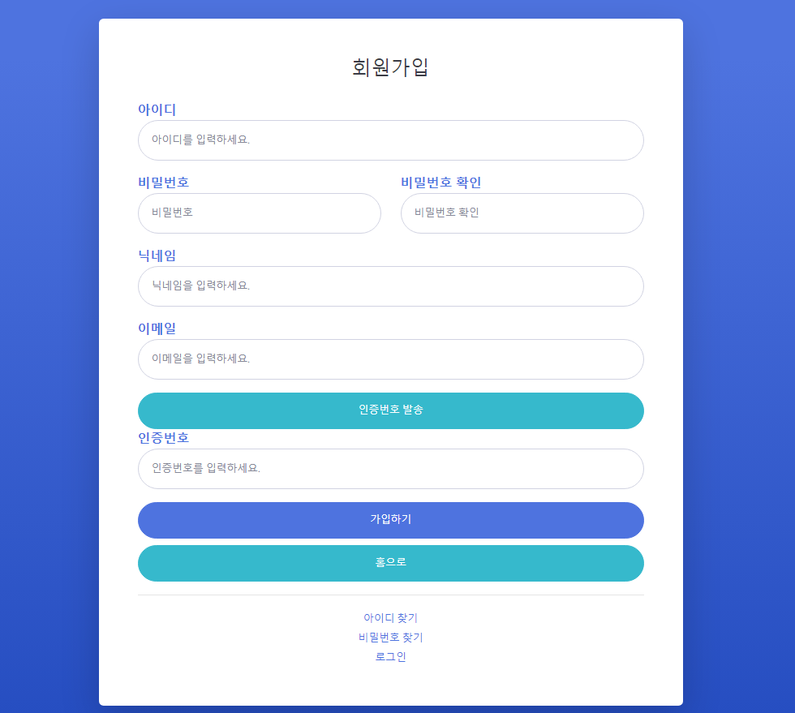

- 아이디 찾기 화면
  - 가입할때 입력한 이메일 입력후 인증을 완료하면 다음 화면에서 아이디 표시
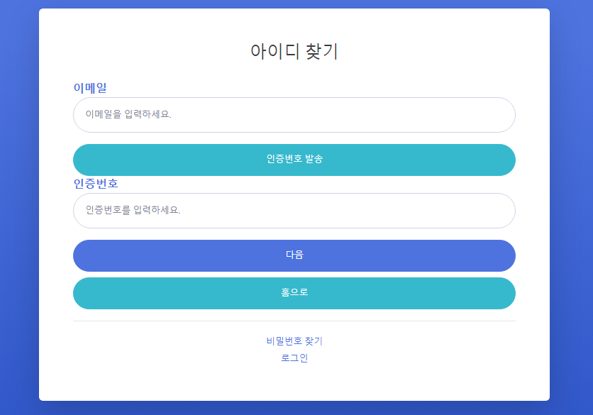

- 비밀번호 찾기 화면
  - 아이디와 가입할때 입력한 이메일이 일치하면 해당 이메일로 임시 비밀번호 발송
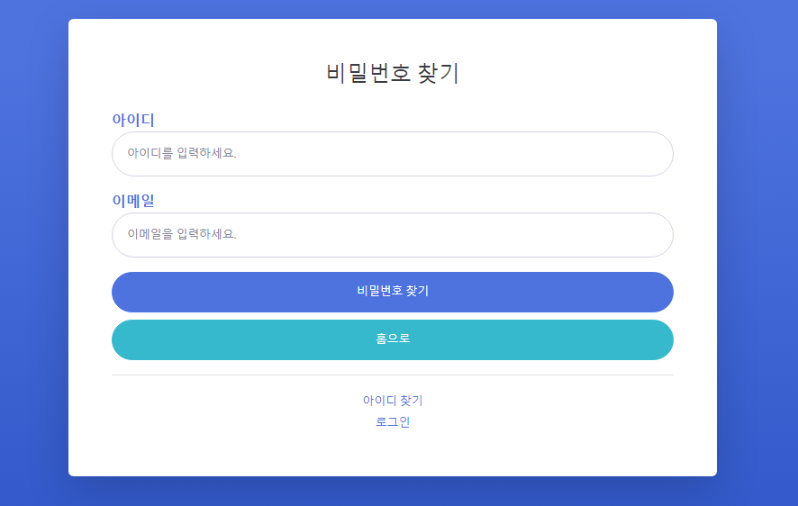
- 모든 이메일 인증은 1분동안 유효

- 로그인 화면
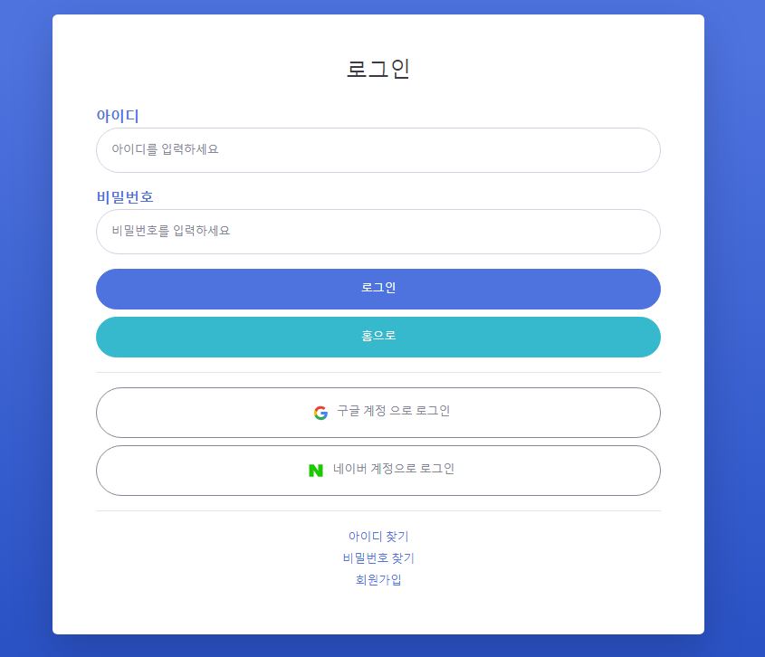
- 구글 계정과 네이버 계정으로 소셜 로그인

- 로그인한 화면
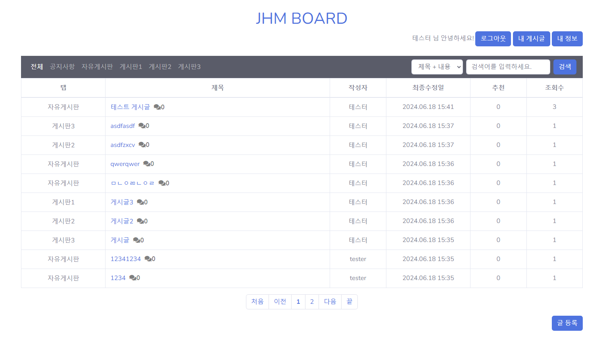
  - 게시글 10개 단위로 페이징 처리
  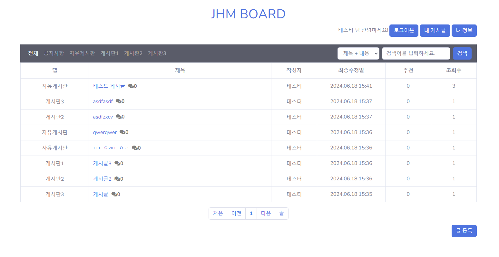
    - 내가쓴 게시글만 보기
  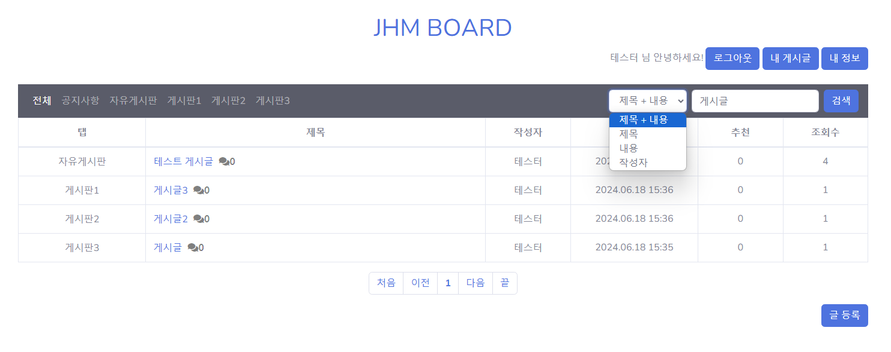
    - 게시글 검색 기능

- 내 정보 화면
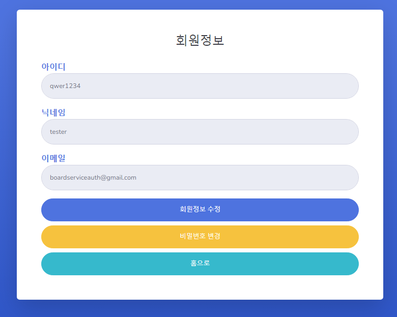
  - 회원 정보 수정으로 닉네임 변경
    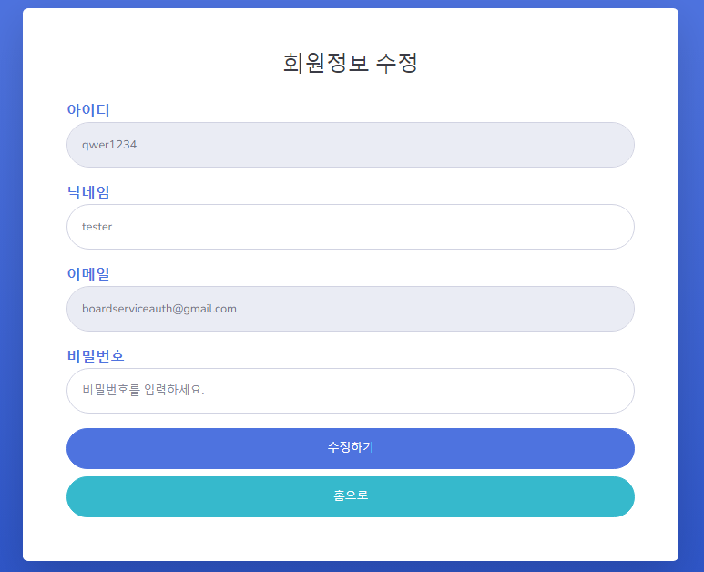
  - 새로운 비밀번호와 비밀번호확인이 일치하면 비밀번호 변경
    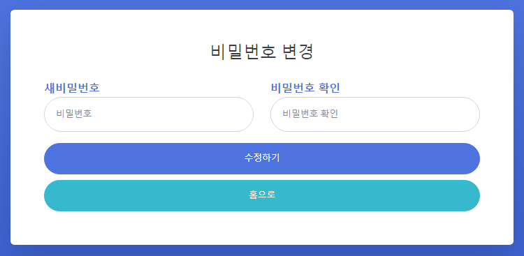

- 게시글 CRUD 기능
  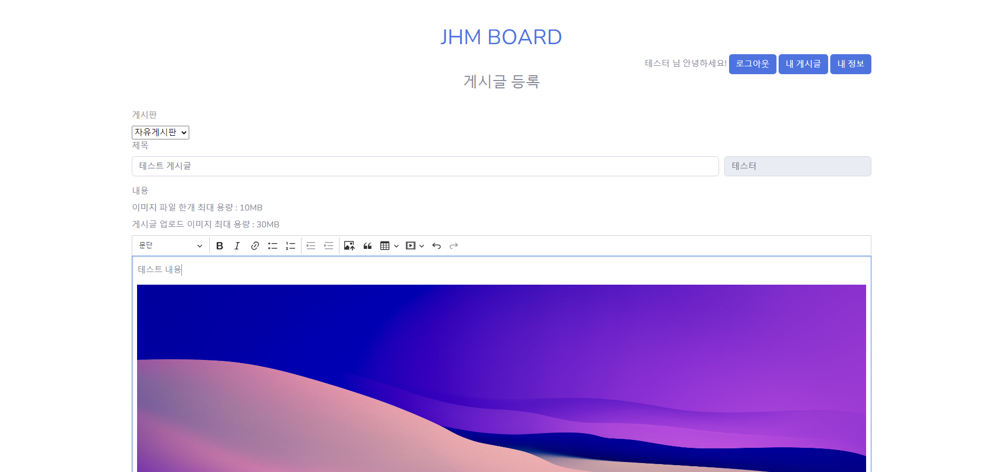
    - 게시글 작성 화면
    - CKEditor 라이브러리를 활용하여 게시글 내용과 이미지 첨부
  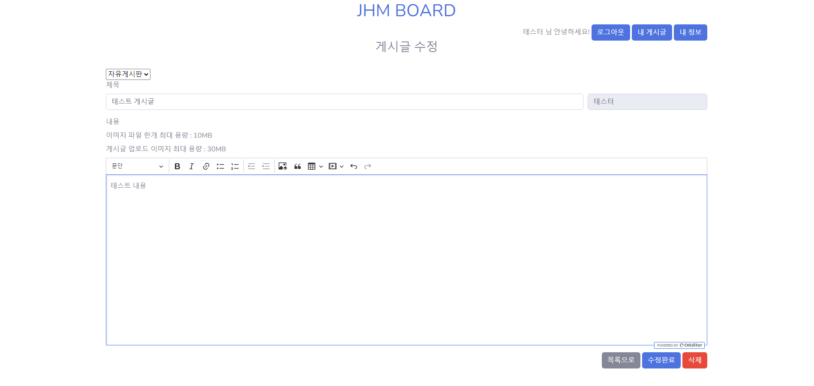
    - 게시글 수정 화면
    - 게시판 카테고리 변경 및 내용 수정, 삭제

- 댓글 CRUD 기능
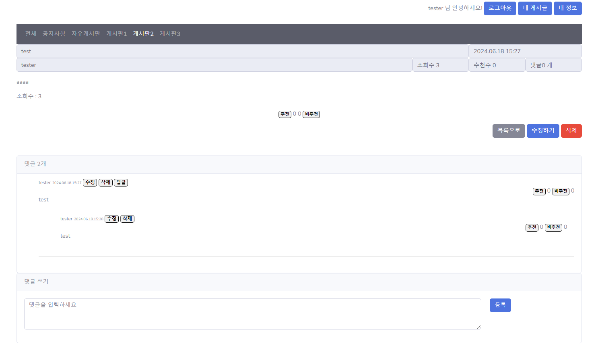
  - 수정기능
    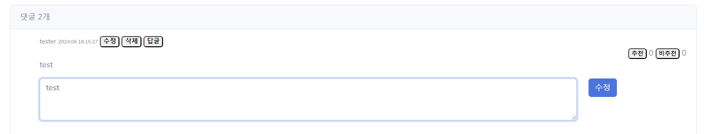
    

- 추천 기능
  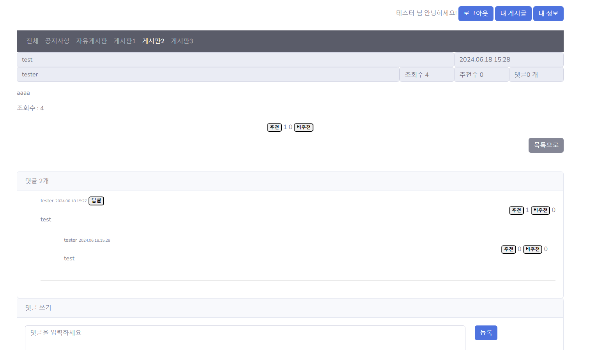
  - 한 아이디당 게시글 하나만 추천, 비추천 1회씩 가능
  - 게시글 추천 테이블에서 유저의 id와 게시글 id 저장
  - 본인의 게시글이나 댓글은 추천, 비추천 불가능
    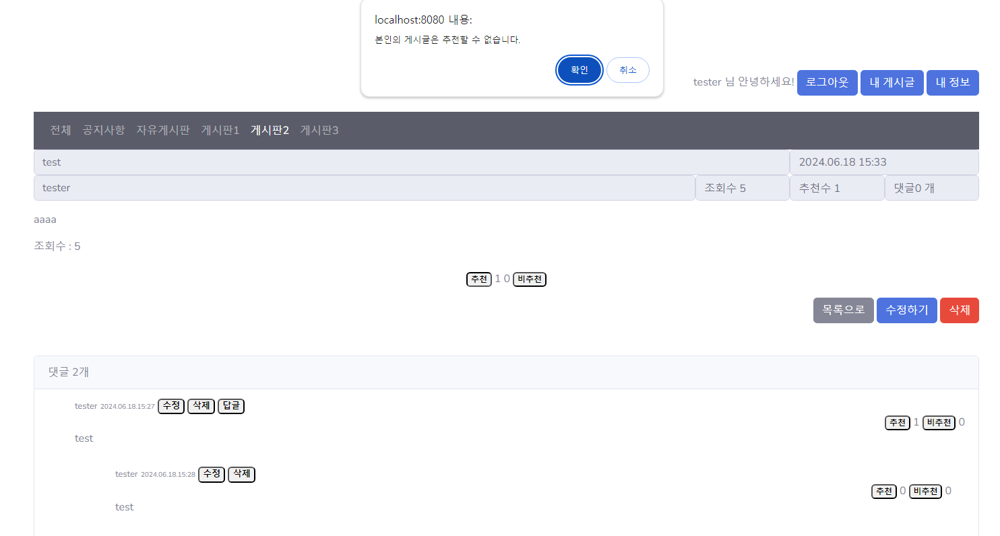
    